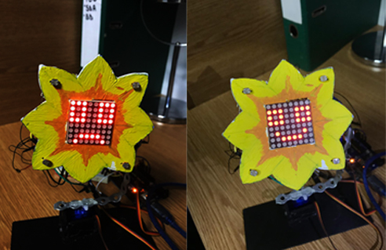

# Project Name :sunflower::sunny:
Solar Tracker (Sun-Flower shaped)

# Description
The ideea behind this project is based on a real life concept used in solar panels, where the light has to be captured as
efficient as it can. Throughout the day the sun moves , and so the solar panels are adjusting their angles so that they 
receive the maximum amount of light, and with that in mind , i've decided to try and replicate the ideea of light-tracking 
into a small and cute sun-flower that its moving towards a light source.

# Extra thing i added
To make the flower feel more realistic i added an 8x8 matrix in the middle so it can give her more personality.
The matrix has 2 different states:
- Happy - when all of the 4 light sensors are getting enough light 
- Sad - when she doesnt receive enough light

# Components
- 1 Arduino Uno
- 1 Bread Board
- 2 Servo motors
- 4 Photoresistors (light sensor)
- 4 10k ohm resistor (for the circuit)
- 1 100k ohm reistor (for the matrix)
- 1 Matrix
- 1 Matrix MAX7219 driver
- Wires

# How does it work
- The project is based on the value of light received by the photoresistors.I've placed 1 sensor in each of the 4 corners of the flower,
and to decide which servo motor is moving i've calculated the arithmetic mean of the top 2 sensors.The principle is also 
applied for the bottom, left and right sensors. After that, i compare the top and the bottom average light so that i can
move the vertical servo motor(if top > bottom move the servo motor in one direction otherwise move it in the other direction)
, and the left and right average for the horizontal servo motor.
- For the matrix i made 1 animation which displays a happy face when 
all of the 4 sensors are receving light over a certain value and 1 animation which displays a sad face when at least one is not
getting enough light

