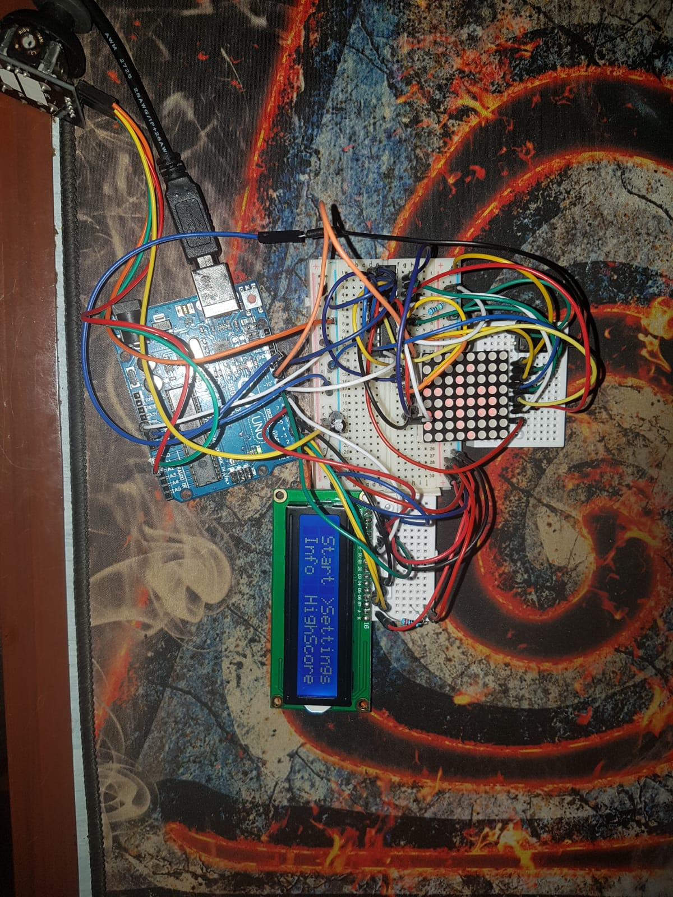

# ProjectName :computer:
DoodleJump 

# Description
In DoodleJump, the aim is to guide a dot-creature named "Doodler" up a never-ending series of 
platforms without falling. The left side of the playing field is connected with the right side.
The player gets points for every 3 seconds he has lived. The player has 3 lives and he will lose one every time he falls

# Levels
The player starts from level 1 and after reaching a certain score he will get to the next level and so on.(10 points are needed to advance to level 2 and 32 points to level 3)
From level 3 the player can play for an infinit amount of time or for how long he can resist.
- Level 1 - width of the platforms is 4, Level 2 - width of the platforms is 3, Level 3 - width of the platforms is 2

# Score
The score is incremented by 1 for every 3 seconds at level 1 , by 2 at level 2 and by 3 at level 3.

# Controls
The movement is being done by using the X axis of thejoystick to control the Doodle left and right and the button 
to modify the left and right jump height.
( also to access the menu while not in game )

# Gameplay
The player will try to stay on the platforms and collect as many points as he can by avoiding falling out of the map.
If the Doodle falls he will be respawed after a quick death animation with the same score and with 1 less life.
Reaching 0 lives will stop the game and the player will be back in the menu screen.

# Interaction with the LCD
The game has 4 sections: Start , Options , Info and HighScore .The user has to press the button to access any of them and 
to press again if he wants to go back to the menu.
- Pressing the Start section will start the game from level 1 , 3 lives and 0 score
- The Option section will allow the player to change the contrast of the LCD and the difficulty of the game which will increase 
the speed at which every line of the matrix is shifted downwards.
- The difficulties are: Baby - 1.5 seconds , Novice - 800 miliseconds , Hero - 600 miliseconds , Insane - 300 miliseconds

- The Info section will display the name of the maker:(my name) , the name of the game , my github link and 
a shoutout to unibucrobotics.
- The highest score will be stored in HScore alongside with the name of the currently player.

# Requirments
* 8x8 LED Matrix
* LCD
* Joystick
* MAX7219 Driver
* Button

# Link to the video:
https://youtu.be/mlrxVCvy0KM

# Asambled Project

## Real Game Demo

